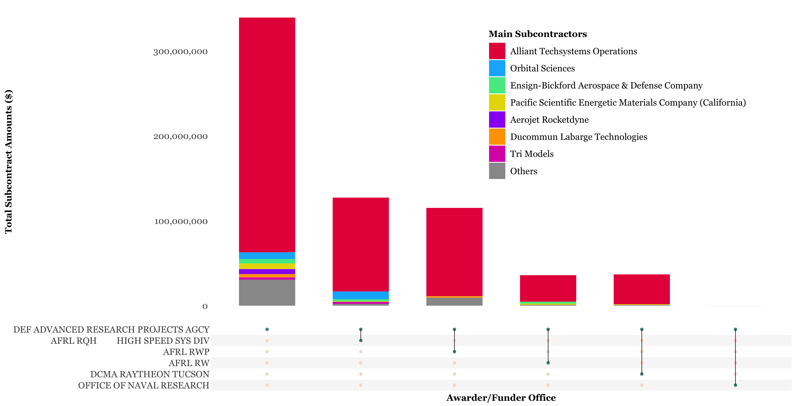

## **1. Introduction** 

Identifying key supply chain participants among Defense Industrial Base companies is vital to quantifying contract risk, preventing cyber-attacks, and consequently prioritizing cyber prevention resources. Also, if it is possible to determine some common characteristics of these key suppliers, which would help to build a practical cyber risk model to evaluate how likely a defense company is to be targeted for cyber espionage.  
This analysis used a contract dataset for hypersonic missile development with a number of subcontractors. The contract was awarded to Raytheon Company, a major U.S. defense contractor and industrial corporation, and then it was subcontracted to almost 100 subcontractors.
It is a typical case for Department of Defense (DOD) contract awarding, which makes the analysis meaningful to scale the analysis result to general DOD contracting.
  Overall, the analysis identified major players in the hypersonic missile development contract and provided some interesting and practical insights about the attributes of subcontractors by conducting data exploratory analysis, natural language processing, and visualization tools.

 

## **2. Analytics**

##### 2.1 Alliant Techsystems Operations are the major player, received fundings from various offices

Figure 1 &nbsp; &nbsp;Funding Sources for major Subcontractors

"Others" represents companies with less than 5 million dollars of total contract amounts

Figure 1 demonstrates popular key subcontractors and their funding resources. To be more specific, “Alliant Techsystems Operations”, “Orbital Sciences”, “Ensign-Bickford Aerospace & Defense Company”, “Pacific Scientific Energetic Materials Company (California)”, “Aerojet Rocketdyne”, “Ducommun Labarge Technologies”, and “Tri Models” are key players in the hypersonic missile development contract.
 In terms of awarding or funding office, their sponsors, there are more than 5 offices participated in the project, and the DEF Advanced Research Project AGCY is the most prominent awarding or funding office.

##### 2.2 Alliant Techsystems Operations got most fundings in 2016, while other companies took part in the project gradually from 2017 to 2021

<iframe src="time2.html" height="750" width="1000" frameBorder="0" allowfullscreen="" allow="autoplay" data-external="3" ></iframe>

Figure 2 &nbsp; &nbsp;Contract Participation of Major Subcontractors from 2016 to 2021 and Corresponding Amounts

It is an interactive plot, users could brush the scatter plot, or click the bar plot

Figure 2 uses time series to display the participation of subcontractors from 2016 to 2021. We could find more than 500 million of the contract amounts were released in 2016, and most of them were provided to Alliant Techsystems Operations, followed by Orbital Sciences. 
 
From 2017 to 2021, there are significantly more medium and small companies joining the project, which could be shown the grey scatters take up larger percentage in these years.

##### 2.3: There are various business types in subcontractors, including some special types of business

<iframe src="total_bar.html" height="750" width="1000" frameBorder="0" allowfullscreen="" allow="autoplay" data-external="3" ></iframe>

Figure 3 &nbsp; &nbsp;Business Types Distribution for Subcontractor

As figure 3 shows, most companies are business for profit, while there is one non-profit organization. Another obvious fact is most companies are in goods manufacturing industry, that is why they could take part in the development project 
It is interesting to explore some not very common and still meaningful business types. They may be helpful to identify the key players in the contract awarding.

##### 2.4: Women-owned business and Limited Liability Company received more fundings, compared to businesses with similar types

<iframe src="vio1.html" height="600" width="1000" frameBorder="0" allowfullscreen="" allow="autoplay" data-external="3" ></iframe>

Figure 4 &nbsp; &nbsp;Average Subcontract Amounts vs Special Owned-business Types

Figue 4 companies 4 similar type businesses, Foreign-Owned, Minority-Owned, Veteran-Owned, and Women-Owned business and their average subcontract amounts.   
The result shows the women-owned business and Veteran-owned business have higher average contract amounts, and the former performs better in the comparison.

 

<iframe src="vio2.html" height="600" width="1000" frameBorder="0" allowfullscreen="" allow="autoplay" data-external="3" ></iframe>

Figure 5 &nbsp; &nbsp;Average Subcontract Amounts vs Business Scale

Similarly, figure 5 compares limited liability company and S corporation, 2 different business types in terms of business scale and taxes. Usually, S corporation represents medium or small companies without pay the company income tax. The result shows the limited liability companies have significantly bigger contract amounts.

##### 2.5: “Contracts and Grants” is one of the important features to identify the key subcontractors

<iframe src="vio3.html" height="600" width="1000" frameBorder="0" allowfullscreen="" allow="autoplay" data-external="3" ></iframe>

Figure 6 &nbsp; &nbsp;Average Subcontract Amounts in different meaningful business types

a surprising but useful insight is found from figure 7. The plot makes a comprehensive comparison with meaningful business types, and we could find that “Contracts and Grants” has much more contract amounts than other business types.  
Actually, there are 4 major companies belong to this business type! It means “Contracts and Grants” would be a practical indicator for key participants in the national defense supply chain. 

## **3. Conclusion**

* "Alliant Techsystems Operations" company is the most important subcontractor in the hypersonic missile development contract, taking up more than 80% contract amounts
* There are more than 5 offices of government provide funding or awarding for subcontractors, and Advanced Research Project AGCY is the major funding resource
* "Alliant Techsystems Operations" company got most fundings in 2016, while other companies took part in the contract gradually from 2017 to 2021
* There are various types of business in the supply chain of hypersonic missile. Although big companies in goods manufacturing are the major roles, medium and small businesses also have a position, especially for some corporations owned by minorities (Veteran/women/foreign/other minorities)
* There are various types of business in the supply chain of hypersonic missile. Although big companies in goods manufacturing are the major roles, medium and small businesses also have a position, especially for some corporations owned by minorities (Veteran/women/foreign/other minorities).  
* “Contracts and Grants” is one of the important features to identify the key participants in the national defense supply chain

 

